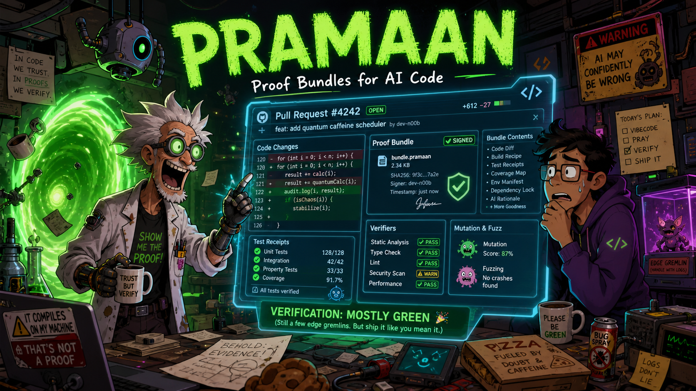
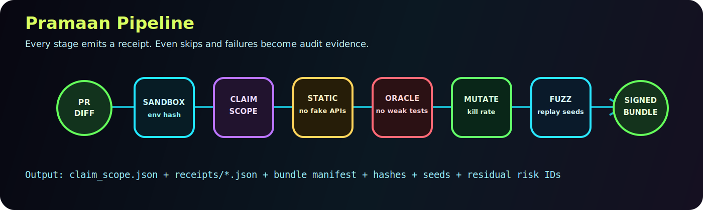
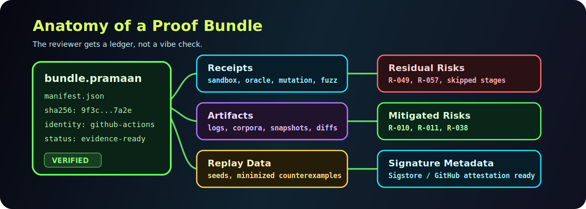

# Pramaan

**Verification infrastructure for AI-authored pull requests.**



AI coding agents are becoming fast enough to write a meaningful share of the
world's software. The bottleneck is no longer generation. The bottleneck is
trust.

Pramaan turns an AI-generated code change into an auditable proof bundle:
structured receipts, execution evidence, risk IDs, replay data, and
hash-linked artifacts that show what was checked and what still needs human
judgment. Sigstore/in-toto signing is on the roadmap; local hash-integrity
verification exists today.

It does not sell the fantasy that a tool can prove arbitrary software correct.
It solves the real problem engineering teams face every day:

> "This pull request is green. Can we trust what green means?"

## The Problem

Modern AI agents can produce code that looks polished, passes CI, and still
breaks production behavior.

The failure mode is subtle:

- the agent weakens the test instead of fixing the bug;
- a snapshot or fixture is updated to approve the wrong behavior;
- the original failing case is never reproduced;
- a fake API, import, parameter, or symbol is invented;
- a new test checks that something exists, not that the behavior is correct;
- the fix works for the narrow prompt but regresses adjacent paths;
- CI logs disappear into a build system with no durable evidence trail.

Traditional CI answers one question: did these commands exit successfully?

Pramaan answers the question reviewers actually need answered:

> What evidence exists that this code change did what it claimed, and what
> risks remain?

## Current Implementation Status

Pramaan is early-stage. The repo already ships a Rust CLI foundation, receipt
schemas with stable `$id` URLs, bundle hash verification, sandbox/environment
evidence, static-check adapters that record the real underlying tool versions,
structured oracle-integrity checks, demo fixtures, mutation adapters that run
when tools are installed, deterministic differential replay evidence, an
uncalibrated auditable confidence vote, and a GitHub Action wrapper.

`pramaan verify` now orchestrates the real stages by default (claim scope,
sandbox setup, static checks, oracle integrity, differential fuzz). Mutation
testing is opt-in via `--with-mutation`. Individual stages can be skipped with
`--skip-stage <name>` for fast iteration.

It does **not** yet ship production-grade Sigstore signing, enforced container
isolation, production-sandboxed Hypothesis/fast-check execution, full
compiler-AST oracle parsing, or calibrated confidence. Bounded generated
Hypothesis/fast-check harnesses can run when those tools are installed; missing
tools remain visible residual risk.

See [STATUS.md](STATUS.md) for the ground-truth feature matrix.

## Operator Docs

- [Quickstart](docs/quickstart.md): one command for the minimum lovable
  verifier loop.
- [Operator Guide](docs/operator-guide.md): install, run, inspect, and rollout.
- [GitHub Action](docs/github-action.md): CI wrapper inputs, permissions, and
  summary behavior.
- [Security Model](docs/security-model.md): trust boundaries and runner
  guidance.
- [Troubleshooting](docs/troubleshooting.md): slow mutation, missing tools,
  flaky tests, forked PRs, and bundle verification.
- [Release Packaging](docs/release.md): manual release gates and artifact
  checklist.
- [Rendered Examples](docs/rendered-examples/README.md): pass, warning, fail,
  and bundle-inspection examples.
- [Competitive Benchmark](docs/competitive-benchmark.md): what Pramaan
  overlaps, reuses, and does differently from AI PR reviewers, quality
  aggregators, test generators, and attestation primitives.
- [Pre-Phase-36 GSD Prompt](.planning/AUTONOMOUS_GSD_BEFORE_PHASE_36_PROMPT.md):
  paste-ready autonomous prompt for finishing all remaining GSD phases before
  language-depth expansion.

## The Pramaan Answer

Pramaan is a receipt-first verification layer for code review. For each pull
request, it is being built toward an inspectable bundle of stage receipts:



```text
PR diff
  -> Claim scope                                  (runs in `pramaan verify`)
  -> Sandbox setup + environment evidence         (runs in `pramaan verify`)
  -> Static and hallucination checks              (runs in `pramaan verify`)
  -> Oracle integrity                             (runs in `pramaan verify`)
  -> Differential fuzz / replay evidence          (runs in `pramaan verify`)
  -> Delta mutation                               (opt-in: --with-mutation)
  -> Auditable confidence vote                    (separate: pramaan confidence explain)
  -> Bundle integrity, signing metadata, attestation
  -> GitHub Action summary                        (rendered from bundle.manifest.json)
```

Every stage emits a receipt, including skipped and failed stages. A reviewer can
see exactly what ran, which tools and versions were used (the real ruff / mypy /
tsc / cargo / mutmut / StrykerJS / cargo-mutants version, not just the Pramaan
wrapper version), which files and artifacts were hashed, which seeds or corpora
were used, which risks were mitigated, and which risks remain.

Pramaan is not another vague AI critic. It is execution-grounded verification
infrastructure.

It should also be understood as a complement to existing tools, not a blanket
replacement. AI PR reviewers, reviewdog-style aggregators, test-generation
systems, and SLSA/Sigstore/in-toto attestations are all useful adjacent tools.
Pramaan's differentiator is the auditable PR evidence bundle around those
signals. See the [competitive benchmark](docs/competitive-benchmark.md) for the
current prior-art map and the claims Pramaan still refuses to make.

## What a Bundle Proves

A Pramaan bundle is a bounded claim, not a magic certificate.



It can prove things like:

- the claimed failing test now passes unchanged;
- existing tests still pass;
- tests were not skipped, deleted, or obviously weakened;
- fixture and snapshot changes were flagged as oracle-sensitive;
- static checks found no invented imports or undefined symbols;
- mutation testing exercised changed behavior and recorded surviving mutants;
- fuzz/property runs used recorded seeds and replay data;
- the proof bundle itself has not been tampered with.

It does not claim:

- "this code is correct";
- "all bugs are impossible";
- "LLM critics agree, so merge it";
- "seven checks means seven independent probabilities."

That restraint is the product. Pramaan gives teams stronger evidence without
pretending uncertainty has disappeared.

## Why This Matters Now

AI code generation changes the economics of software review. A human reviewer
can no longer inspect every generated line with the same attention as hand-made
code, especially when agents produce many small PRs per day.

The next layer of the developer toolchain needs to be:

- **auditable**: every conclusion has an artifact behind it;
- **execution-grounded**: checks run against real base/head code, not only prose;
- **risk-aware**: the output says what remains dangerous;
- **replayable**: failures and fuzz cases can be reproduced;
- **signable**: evidence is hash-linked today and designed for future signing;
- **honest**: no false claim of full correctness.

Pramaan is built as that layer.

## Core Capabilities

### Receipt-First Verification

Every stage writes structured JSON receipts with:

- stage name and status;
- tool identity and version;
- input and artifact hashes;
- start/end timestamps;
- exit code and summary;
- mitigated, residual, skipped, and not-applicable risk IDs.

### Claim Scope

Pramaan records what the pull request claims to change before judging whether
the tests and execution evidence are aligned with that claim.

This catches a major AI-code failure mode: a PR that passes tests while solving
the wrong problem, overfitting the prompt, or approving behavior outside the
intended scope.

### Oracle Integrity

Pramaan treats tests, fixtures, and snapshots as part of the trust boundary.

It is designed to detect:

- skipped tests;
- removed assertions;
- weakened assertions;
- changed snapshots;
- changed fixtures;
- missing original failing tests;
- suspicious oracle drift.

This is the killer use case: normal CI can go green because the agent weakened
the test. Pramaan should turn that into a clear red receipt.

### Static and Hallucination Checks

AI-generated code often fails by inventing plausible names:

- non-existent imports;
- undefined variables;
- invented APIs;
- invalid parameters;
- wrong file or resource names.

Pramaan classifies these failures instead of flattening them into generic
"lint failed" output.

### Delta Mutation

Coverage is not enough. A test can execute code without asserting the behavior
that matters.

Pramaan is being built to use diff-scoped mutation testing to ask a sharper
question:

> If we perturb the changed logic, do the tests actually notice?

Current code has mutation command wrappers, receipt normalization, raw-output
digests, and skipped-tool receipts. The tools run when installed; missing tools
remain visible residual evidence rather than a pass.

### Property, Fuzz, and Differential Checks

For eligible changed functions, Pramaan compares base and head behavior on
shared generated inputs. Current code has deterministic replay evidence for
narrow pure-function fixtures and records whether Hypothesis or fast-check was
available. Real tool-backed Hypothesis and fast-check campaigns remain roadmap
work.

This is how Pramaan catches "the bug is fixed, but nearby behavior changed."

### Signed Proof Bundles

Receipts and artifacts are collected into a bundle manifest. The bundle can be
verified for hash integrity today and is prepared for future Sigstore, GitHub
artifact attestation, and in-toto/SLSA-style provenance flows.

## Non-Goals

Pramaan deliberately does not claim to be:

- a proof that arbitrary software is correct;
- an automatic merge authority;
- a replacement for CI;
- a generic agent registry;
- a dashboard-first product before the CLI and GitHub Action are trustworthy.

## Illustrative Reviewer Summary

This is the direction of the reviewer experience, not a guarantee that every
line below is emitted by the current `verify` command in one integrated run.
See [STATUS.md](STATUS.md) and [Claim Audit](docs/claim-audit.md) for what
ships today.

```text
Claim
  Fix invoice rounding for mixed tax rates.

Evidence
  PASS  Original failing test now passes unchanged.
  PASS  Existing tests still pass.
  PASS  No assertions were weakened.
  PASS  Static checks found no invented imports or undefined symbols.
  WARN  Mutation killed 87% of changed-line mutants; 3 survived.
  PASS  Differential property checks found no unexpected divergence.

Residual risks
  R-049 concurrency not exercised.
  R-057 performance not benchmarked.
  R-081 formal verification not applicable.

Bundle
  Hash verified.
  Tool versions recorded.
  Seeds and corpus hashes recorded.
```

## Research Basis

Pramaan is grounded in software testing research, AI-code evaluation failures,
and production supply-chain tooling.

### AI-code reliability

- [tau2-bench](https://arxiv.org/abs/2506.07982): repeated evaluation exposes unreliable agent behavior.
- [SWE-Lancer](https://arxiv.org/abs/2502.12115): frontier models can silently fail real software tasks.
- [SWE-bench Verified](https://openai.com/index/introducing-swe-bench-verified/): shows why benchmark/task curation matters.
- [SWE-bench Verified retirement analysis](https://openai.com/index/why-we-no-longer-evaluate-swe-bench-verified/): motivates claim-scope and oracle-alignment receipts.

### Step-level verification

- [Let's Verify Step by Step](https://arxiv.org/abs/2305.20050): supports process evidence over only binary final outcomes.
- [Lost in the Middle](https://arxiv.org/abs/2307.03172): motivates chunked receipts rather than giant context reviews.

### LLM judge limitations

- [Self-preference bias](https://arxiv.org/abs/2410.21819): warns against trusting model self-judgment.
- [Position bias in LLM judges](https://arxiv.org/html/2406.07791v9): motivates careful critic design.
- [Don't Judge by Its Cover](https://arxiv.org/abs/2505.16222): critic agreement is signal, not proof.
- [CodeJudge](https://arxiv.org/abs/2410.02184): useful as a specialized review signal, never the sole gate.

### Hallucination detection

- [CodeHalu](https://arxiv.org/abs/2405.00253): supports code hallucination categories.
- [Collu-Bench](https://arxiv.org/html/2410.09997v1): motivates detection beyond syntax failures.
- [Delulu](https://arxiv.org/abs/2605.07024): covers invented APIs, invalid parameters, undefined variables, and non-existent imports.

### Mutation and test quality

- [Just et al., FSE 2014](https://homes.cs.washington.edu/~mernst/pubs/mutation-effectiveness-fse2014.pdf): mutation testing correlates with real fault detection.
- [Papadakis et al., ICSE 2018](https://dl.acm.org/doi/pdf/10.1145/3180155.3180183): mutation testing is useful but imperfect.
- [LLMorpheus](https://arxiv.org/abs/2404.09952): connects mutation-style testing to LLM-generated-code defects.
- [mutmut](https://mutmut.readthedocs.io/en/latest/), [StrykerJS](https://stryker-mutator.io/docs/stryker-js/incremental/), and [cargo-mutants](https://mutants.rs/timeouts.html): practical engines for Python, TypeScript, and Rust.

### Fuzzing and differential testing

- [Fuzz4All](https://arxiv.org/abs/2308.04748): demonstrates broad fuzzing gains.
- [Agentic property-based testing](https://arxiv.org/html/2510.09907v1): motivates generated property checks with replayable evidence.
- [CodaMosa](https://dl.acm.org/doi/10.1109/ICSE48619.2023.00085): supports search-based test amplification.
- [Metamorphic Prompt Testing](https://arxiv.org/abs/2406.06864): motivates metamorphic relations when direct assertions are hard.
- [Hypothesis](https://hypothesis.readthedocs.io/en/latest/reference/api.html) and [fast-check](https://fast-check.dev/docs/introduction/why-property-based/): production property-testing engines.

### Supply-chain attestations

- [SLSA](https://slsa.dev/spec/): provenance and build-integrity framework.
- [Sigstore](https://docs.sigstore.dev/cosign/signing/overview/): keyless signing and transparency-backed identity.
- [in-toto](https://in-toto.io/): supply-chain attestation framework.
- [GitHub artifact attestations](https://docs.github.com/en/actions/concepts/security/artifact-attestations): practical CI-native signed provenance.
- [Nix reproducibility research](https://arxiv.org/pdf/2501.15919): informs the honest boundary around bit-for-bit reproducibility.

## Why Pramaan Is Different

Most tools give one thin signal:

- CI says commands passed.
- Coverage says code was executed.
- A critic says the patch looks reasonable.
- A scanner says one class of issue was or was not found.

Pramaan combines these into a risk-aware evidence bundle. The value is not any
single check. The value is the ledger:

- what was claimed;
- what was checked;
- what evidence supports it;
- what changed in the oracle;
- what was skipped;
- what remains risky;
- who/what signed or produced the bundle, when signing metadata is available.

## Intended Users

Pramaan is for teams that expect AI agents to contribute production code:

- engineering leaders adopting coding agents;
- platform teams building agent review gates;
- security teams that need audit trails for AI-authored changes;
- open-source maintainers reviewing AI-generated PRs;
- enterprises that need evidence before merging automated code.

## Repository Map

- [crates/pramaan-cli](crates/pramaan-cli): CLI entry point and stage commands.
- [crates/pramaan-core](crates/pramaan-core): receipt, claim-scope, risk, and shared models.
- [crates/pramaan-sandbox](crates/pramaan-sandbox): worktree and environment evidence.
- [crates/pramaan-bundle](crates/pramaan-bundle): bundle manifest, hashing, signing metadata, and verification.
- [schemas](schemas): public JSON Schemas.
- [docs](docs): product and operator documentation.
- [examples](examples): fixtures, demos, and synthetic receipts.
- [plugins](plugins): language plugin plans and adapters.
- [.planning](.planning): GSD planning, requirements, research, and phase validation.

## Quickstart

Verify a PR's diff with the default stage set (claim scope, sandbox,
static checks, oracle integrity, differential fuzz):

```bash
cargo run -p pramaan-cli -- verify \
  --base origin/main --head HEAD \
  --out target/pramaan
```

Add mutation testing (slower, opt-in):

```bash
cargo run -p pramaan-cli -- verify \
  --base origin/main --head HEAD \
  --out target/pramaan \
  --with-mutation
```

Fast iteration: skip stages you don't need right now:

```bash
cargo run -p pramaan-cli -- verify \
  --base origin/main --head HEAD \
  --out target/pramaan \
  --skip-stage static_checks --skip-stage fuzz
```

Optional CI attribution — set these env vars to record which AI coding agent
produced the change. Absent by default; never inferred:

```bash
export PRAMAAN_AGENT_PRODUCT="Codex"
export PRAMAAN_AGENT_MODEL_FAMILY="gpt-5"
export PRAMAAN_AGENT_MODEL_VERSION="..."
export PRAMAAN_AGENT_EXECUTION_MODE="ci_pull_request"
export PRAMAAN_AGENT_SOURCE="github_actions"
```

Validate the workspace:

```bash
cargo fmt --all -- --check
cargo clippy --workspace --all-targets -- -D warnings
cargo test --workspace -- --test-threads=1
```

## Documentation

- [Tasks to Serious v1](TASKS.md)
- [Receipt model](docs/receipt-model.md)
- [Risk taxonomy](docs/risk-taxonomy.md)
- [Bundle verification](docs/bundle-verification.md)
- [Attestation](docs/attestation.md)
- [GitHub Action](docs/github-action.md)
- [Killer demo](docs/demo.md)
- [Research index](docs/RESEARCH_INDEX.md)
- [Claim audit](docs/claim-audit.md)
- [Roadmap](.planning/ROADMAP.md)

## License

Pramaan is licensed under the MIT License. See [LICENSE](LICENSE).
